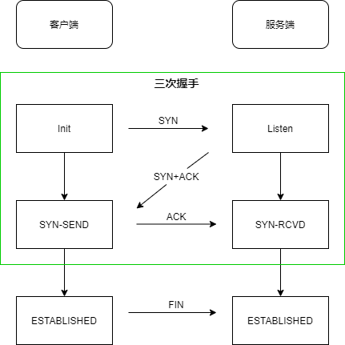
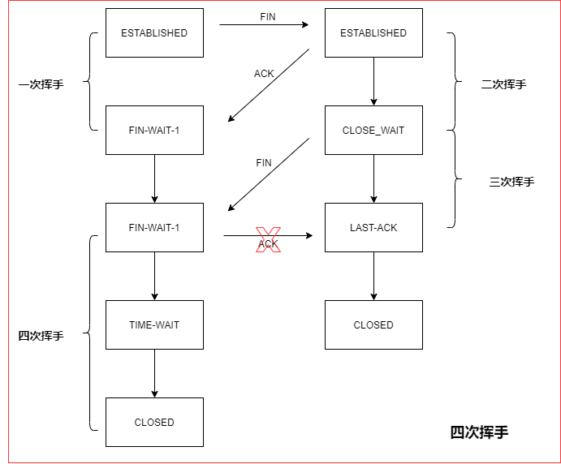

# TCP协议与UDP协议 & 什么是三次握手与四次挥手

tcp协议和udp协议都工作在传输层，他们的目标都是在程序之间传数据。
数据可以是文本文件可以是视频也可以是图片。

## TCP和UDP区别是什么

TCP基于连接，UDP基于非连接

### 举个例子

如果把人与人的通信，比喻为进程与进程的通信。

有两种方式，不过这两种方式之间最大的区别是什么？

1. 写信，基于非链接UDP
   1. 对方是否能收到
   2. 内容是否完整
   3. 消息是否按顺序
   4. 收信地址收信人是否存在，都无法确认
2. 打电话，基于TCP连接
   1. 电话接通
   2. 互相通话
   3. 结束挂断
   4. 这一系列的流程都能得到及时的反馈

## TCP是如何保证打电话以上的过程

有三个关键步骤

1. 三次握手
2. 传输确认
3. 四次挥手

三次握手是建立连接的过程，当客户端向服务端发起连接时，会先发一包连接请求数据，过去询问一下能否与你建立连接，这一包数据称之为SYN包，如果对端同意连接，回复一包SYN+ACK包，客户端收到之后回复一包ACK包，建立连接，这个过程中互相发送了三包数据。称为三次握手。

 

## 为什么要三次握手而不是两次握手？
- 服务端回复完，SYN+ACK之后就建立连接这是为了防止因为已失效的请求报文突然又传到服务器引起的错误。

#### 假设采用两次握手建立连接

客户端像服务端发送了一个SYN包来请求建立连接因为某些未知的原因并没有到达服务器在中间某个网络节点产生了滞留为了建立连接客户端会重发SYN包，这次的数据包正常送达，服务端回复SYN+ACK之后建立起了连接，但是第一包数据阻塞的网络节点突然恢复，第一包SYN包又送达到服务端，这时服务端会误认为是客户端又发起了一个新的连接，在两次握手之后进入等待数据状态服务端认为是两个连接，如果在三次握手的情况下服务端收不到最后的ACK包自认不会认为连接建立成功，所以三次握手本质上来说就是为了解决网络信道不可靠的问题。
为了能够在不可靠的信道上建立起可靠的连接，经过三次握手之后客户端和服务端都进入了数据传输状态。TCP协议需要在不可靠的信通上保证可靠的连接。

问题：

1. 一包数据有可能会被拆分多包发送如何处理丢包的问题
2. 这些数据包到达的先后顺序不同如何处理乱序的问题
   

针对这些要求TCP协议为每一个连接建立了一个发送缓冲区，从建立连接后的第一个字节的序列号为0，后面每个字节的序列号就会增加1，取一部分数据组成发送报文，在其TCP协议头中会附带序列号和长度接收端在收到数据后需要回复确认报文，确认报文中的ACK等于接受序列号加长度也就是下一包数据，需要发送的起始序列号，一问一答的发送方式能够使发送端确认发送的数据已经被对方收到，发送端也可以一次发送连续的多包数据，接收端只需要回复一次ACK就可以了这样发送端可以把待发送的数据分割成一系列的碎片发送到对段，对端根据序列号和长度在接受后重构出来完整的数据。

假设其中丢失了某些数据包在接收端可以要求发送端重传。**TCP连接是全双工的**。

## 四次挥手是什么

四次挥手处于连接状态的客户端和服务端都可以发起关闭连接请求，此时需要四次挥手来进行连接关闭。

假设客户端主动发起连接关闭请求，他需要将服务端发起一包FIN包表示要关闭连接，自己进入终止等待1状态，这是一次挥手。服务端收到FIN包发送一包ACK包标识自己进入了关闭等待状态，客户端进入终止等待2状态，这是二次挥手。服务端此时还可以发送未发送的数据，而客户端还可以接收数据，待服务端发送完数据之后发送一包FIN包进入最后确认的状态，这是第三次挥手。客户端收到之后回复ACK包进入超时等待状态，经过超时时间后关闭连接，而服务端收到ACK包后立即关闭连接，这是四次挥手。

#### 为什么客户端需要等待超时时间

这是为了保证对方已收到的ACK包。因为假设客户端发送完最后一包ACK包后就释放了连接。一旦ACK包在网络丢失，服务端将一直停留在最后确认的状态，如果客户端发送最后一包ACK包等待一段时间，这时服务端因为没有收到ACK包会重发FIN包，客户端会响应这个FIN包，重发ACK包并刷新超时时间，这个机制跟三次握手一样也是为了保证在不可靠的网络链路中进行可靠的连接断开确认