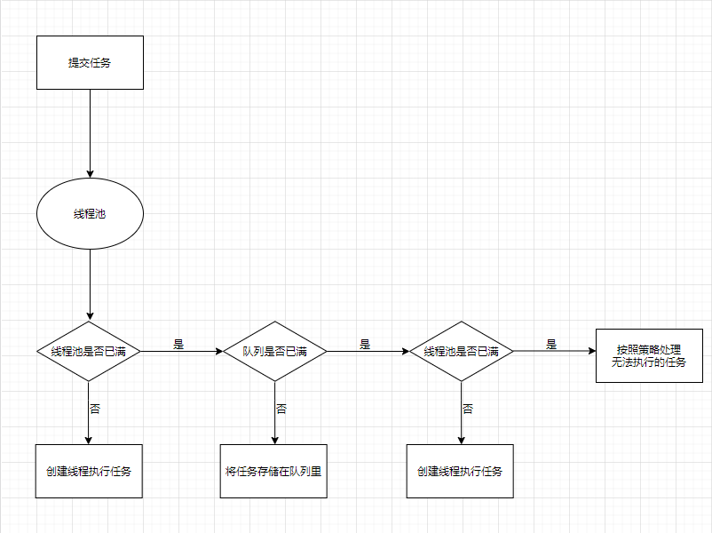
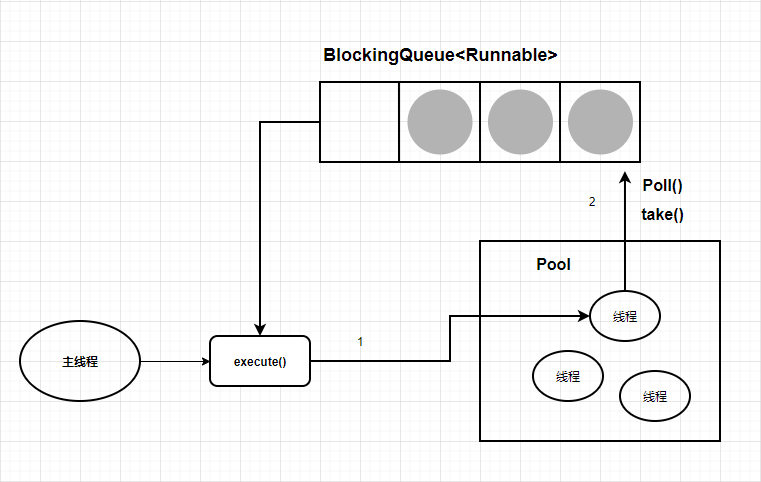
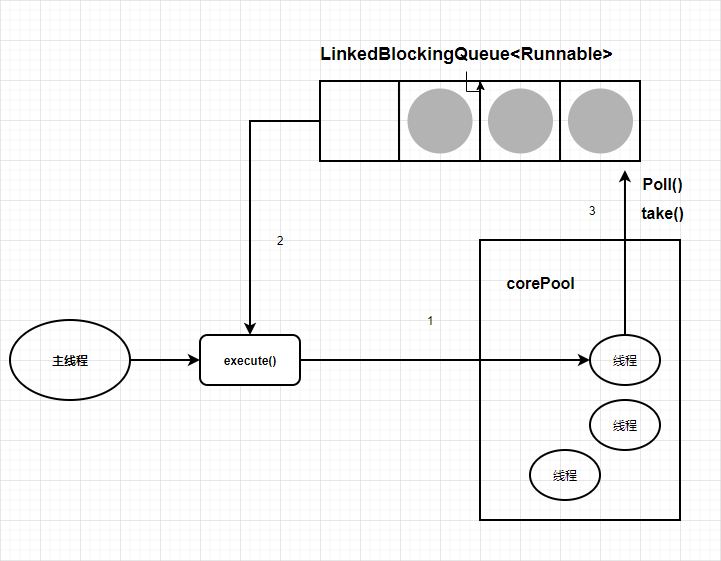
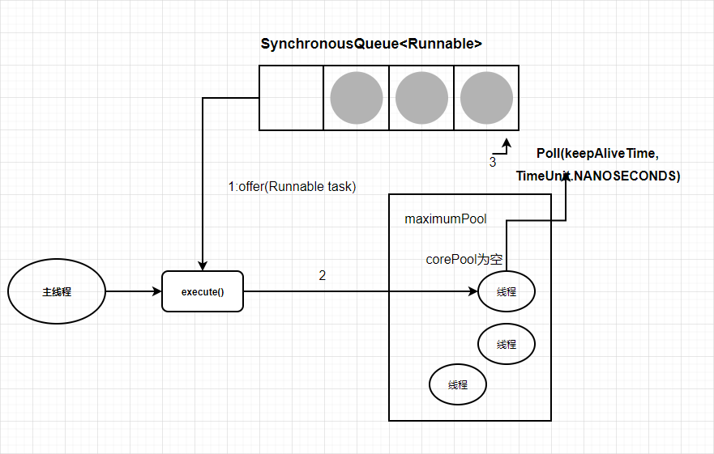
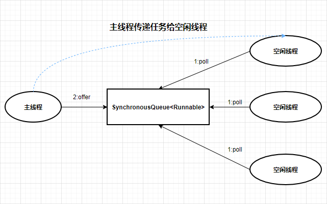

# ThreadPoolExecutor 介绍 使用

​	想用好ThreadPoolExecutor线程池就必须要了解线程、进程和线程池是什么

## 什么是线程、线程和进程的区别是什么？

​	线程、程序执行流的最小执行单元，是行程中的实际运作单位。
​	进程是一个动态的过程，是一个活动的实体。一个应用程序(英雄联盟)的运行就可以被看作是一个进程，而线程是运行中的实际的任务执行者。进程中包含了多个可以同时运行的线程。

## 单线程和多线程的区别？

### 单线程

​	在程序执行时，所走的程序路径按照连续的顺序排下来，前面的操作处理好，后面才会执行。必须等待程序完成了当前任务以后才能开始相应。一个人吃一碗泡面，十分钟吃完。

### 多线程

​	是指一个应用程序同时执行多个任务，一般来说一个任务就是一个线程，而一个应用程序有一个以上的线程我们成为多线程。多个人吃一碗泡面，一分钟吃完。

## 线程池

​	线程池事一种多线程处理形式，处理过程中将任务添加到队列，然后在创建线程后自动启动这些任务。线程池线程都是后台线程。每个线程都使用默认的堆栈大小，以默认的优先级运行，并处于多线程单元中。如果某个线程在托管代码中空闲(如正在等待某个事件)，则线程池将插入另一个辅助线程来使所有处理器保证繁忙。如果所有线程池线程都始终保证繁忙，但队列中包含挂起的工作，则线程池将在一段时间后创建另一个辅助线程但现成的数目永远不会超过最大值。超贵最大值的线程可以排队，但是他们要等到其他线程完成后才启动。

### 好处

1. **降低资源消耗**。通过重复利用已创建的线程降低线程创建和销毁的造成的消耗。
2. **提高响应速度**。当任务到达时，任务可以不需要等到线程创建就能立即执行。
3. **提高线程的可管理性**。线程是稀缺资源，如果无限制地创建，不仅会消耗系统资源，还会降低系统的稳定性，使用线程池可以进行统一分配，调优和监控。

### 实现原理

​	

1. 线程池判断核心线程池里的线程是否都执行任务。如果不是，则创建一个新的工作线程来执行任务。如果核心线程池里的线程都在执行任务，进入下个流程。
2. 线程池判断工作队列是否已经满。如果工作队列没有满，则将新提交的任务存储在这个工作队列中。如果工作队列满了，进入下个流程。
3. 线程池判断线程池的线程是否都处于工作状态。如果没有，创建一个新的工作线程来执行任务。如果满了，交给饱和策略来处理这个任务。

### 执行execute方法分下面4种情况


1. 如果当前运行的线程少于corePoolSize，则创建新线程来执行任务(执行这步骤需要获取全局锁)。
2. 如果运行的线程等于或多余corePoolSize，则将任务假如BlockingQueue。
3. 如果无法将任务假如BlockingQueue(队列已满)，则创建新的线程来处理任务(执行这步骤需要获取全局锁)。
4. 如果创建新线程使当前运行的线程超出maxmumPoolSize，任务将被拒绝，并调用RejectedExecutionHandler.rejectedExecution()方法。

ThreadPoolExecutor采取步骤的总体设计思路，是为了再执行execute()方法时，尽可能地避免获取全局锁(会是一个严重的可伸缩瓶颈)。在ThreadPoolExecutor完成预热之后(当前运行的线程数大于等于corePoolSize)，几乎所有的execute()方法调用都是执行步骤2，而步骤2不需要获取全局锁。

**源码分析(JDK1.7)**

```java
public void execute(Runnable command) {
    if (command == null) {
        throw new NullPointerException();
    }
	// 如果线程数小于基本线程数，则创建线程并执行当前任务
	if (poolSize >= corePoolSize || !addIfUnderCorePoolSize(command)) {
        // 如线程数大于等于基本线程数或线程创建失败，则将当前任务放到工作队列种
        if (runState != RUNNING || poolSize == 0) {
            ensureQueuedTaskHandled(command);
        }
	// 如果线程池不处于运行中或任务无法放入队列，并且当前线程数量小于最大允许的线程数量，
    // 则创建一个线程执行任务
    } else if (!addIfUnderMaximumPoolSize(command)) {
        // 抛出RejectedExecutionException异常
        reject(command);
    }
}
```

**工作流程**：线程池创建线程时，会将线程封装工作线程Worker，Worker在执行完任务后，还会循环获取工作队列的任务来执行。

线程池中的线程执行任务分两种情况：


1. 在execute()方法中创建一个线程时，会让这个线程执行当前任务。
2. 这个线程执行完上图1的任务后，会反复从BlockingQueue获取任务来执行。

## 使用

### 创建

```java
new ThreadPoolExecutor(corePoolSize, maximumPoolSize, 
                       keepAliveTime, unit, workQueue, threadFactory，handler);
```

1. **corePoolSize**(线程池的基本大小)：当提交一个任务到线程池时，线程池会创建一个线程来执行任务，即使其他空闲的基本线程能够执行新任务也会创建线程，等到需要执行的任务数大于线程池基本大小时就不再创建。如果调用了线程池的**prestartAllCoreThreads**()方法，线程池会提前创建并启动所有基本线程。

2. **maximumPoolSize**(线程池最大数量)：线程池允许创建最大线程数。如果队列满了，并且已创建的线程数小于最大线程数，线程池会再创建新的线程执行任务。如果使用了**无界的任务队列**这个参数并没有效果。

3. **keepAliveTime**(线程活动保持时间)：线程池的工作线程空闲后，保持存活的时间。如果任务很多，并且每个任务执行的时间比较短，可以调大时间，提高线程的利用率。

4. **unit**( 线程活动保持时间的单位)：可选的单位有天、小时、分钟、毫秒、微妙、纳秒、千分之一微秒。

5. **workQueue**(任务队列)：用于保存等待执行任务的阻塞队列。

   阻塞队列有：

   1. **ArrayBlockingQueue**：是一个基于数组结构的有界阻塞队列，此队列按FIFO(先进先出)原则对元素进行排序。
   2. **LinkedBlockingQueue**：是一个基于链表结构的阻塞队列，此队列按FIFO排序元素，吞吐量通常要高于**ArrayBlockingQueue**：静态工厂方法**Executors.newFixedThreadPool(nThreads)**使用了这个队列。
   3. **SynchronousQueue**：一个不存储元素的阻塞队列。每个插入操作必须等到另一个线程调用移除操作，否则插入操作一直处于阻塞状态，吞吐量通常要高于**LinkedBlockingQueue**，静态工厂方法**Executors.newCachedThreadPool()**使用了这个队列。
   4. PriorityBlockingQueue：一个具有优先级的无限阻塞队列。

6. **threadFactory**(创建线程的工厂)：用于设置创建线程的工厂，可以通过线程工厂给每个创建出来的线程设置更有意义的名字。

7. **handler**(饱和策略)：当队列和线程池都满了，说明线程池处于饱和状态，那么必须采取一种策略处理提交的新任务。这个策略默认情况下是**AbortPolicy**，表示无法处理新任务时抛出异常。

   饱和策略有：

   1. **AbortPolicy**：直接抛出异常。
   2. **CallerRunsPolicy**：只用调用者所在线程来运行任务。
   3. **DiscardOldestPolicy**：丢弃队列里最近的一个任务，并执行当前任务。
   4. **DiscardPolicy**：不处理，丢弃掉。

### 提交任务

可以使用两个方法向线程池提交任务，分别为execute()和submit()方法。

#### execute

​	execute()方法用于提交不需要返回值的任务，所以无法判断任务是否被线程池执行成功。

```java
threadPoolExecutor.execute(() ->{
    // todo 
})
```

#### submit

​	submit()方法用于提交需要返回值的任务。线程池会返回一个Future类型的对象值，通过这个future对象可以判断任务是否执行成功，并且可以通过future的get()方法来获取返回值，get()方法会阻塞当前线程直到任务完成，而使用get(long timeout, TimeUnit unit)方法则会阻塞当前线程一段时间后立即返回，这时候有可能任务没有执行完成。

```java
Future<String> submit = threadPoolExecutor.submit(() -> "1");
        try {
            submit.get();
        } catch (InterruptedException e) {
            // 处理中断异常
        } catch (ExecutionException e) {
            // 处理无法执行任务异常
        } finally {
            // 关闭线程池
            threadPoolExecutor.shutdown();
        }
```

### 关闭

​	通过线程池的shutdown或shutdownNow方法来关闭线程池。它们的原理是遍历线程池的工作线程，然后逐个调用线程的interrupt方法来中断线程，所以无法响应中断的任务可能永远无法终止。但是它们存在一定的区别，shutdownNow首先将线程池的状态设置成stop，然后尝试停止所有的正在执行或暂停任务的线程，并返回等待执行任务的列表，而shutdown只是将线程池的状态设置成shutdown状态，然后中断所有没有正在执行任务的线程。
​	只要调用这两个关闭方法的任意一个，isShutdown方法就会返回true。当所有的任务都已关闭后，才表示线程池关闭成功，这时调用isTerminaed方法会返回true。至于应该调用哪一种方法来关闭线程池，应该由提交到线程池的任务特性决定，通常调用shutdown方法来关闭线程池，如果任务不一定要执行完，则可以调用shutdownNow方法。

### 监控

如果在系统中大量使用线程池，有必要对线程池进行监控，方便再出现问题时，可以根据线程池的使用状态快速定位问题。可以通过线程池提供的参数进行监控，在监控线程池的时候可以使用一下属性。

1. taskCount：线程池需要执行任务的数量。
2. completedTaskCount：线程池在运行过程中已完成的任务数量，小于或等于taskCount。
3. largestPoolSize：线程池里曾经创建过的最大线程数量。通过这个数据可以知道线程池是否曾经满过。该数值等于线程池的最大小，标识线程池曾经满过。
4. getPoolSize：线程池的线程数量。如果线程池不销毁的话，线程池里的县城不会自动销毁，所以这个大小是增不减。
5. getActiveCount：获取活动的线程数。

通过扩展线程池进行监控。可以通过继承线程池来自定义线程池，重写线程池的beforeExecute，afterExecute和terminated方法，业可以在任务执行前、执行后和线程池关闭前执行一些代码来进行监控。例如监控任务的平均执行时间、最大执行时间和最小执行时间等。

## Executor工具类

Executor框架最核心的类是ThreadPoolExecutor，它是线程池的实现类。

通过Executor工具类可以创建3种类型的ThreadPoolExecutor。

- [FixedThreadPool](#FixedThreadPool)
- [SingleThreadExecutor](#SingleThreadExecutor)
- [CachedThreadPool](#CachedThreadPool)

### <span id="FixedThreadPool">FixedThreadPool</span>

**FixedThreadPool**被称为可重用固定线程数的线程池。

```java
    public static ExecutorService newFixedThreadPool(int nThreads) {
        return new ThreadPoolExecutor(nThreads, nThreads,
                                      0L, TimeUnit.MILLISECONDS,
                                      new LinkedBlockingQueue<Runnable>());
    }
```

​	FixedThreadPool的corePoolSize和maximumPoolSize都被设置为创建FixedThreadPool时指定的参数nThreads。

​	当线程池中的线程数大于corePoolSize时，keepAliveTime为多余的空闲线程等待新任务的最长时间，超过这个时间后多余的线程将被终止。这里把keepAliveTime设置为0L，意味着多余的空闲线程会被立即终止。



1. 如果当前运行的线程数少于corePoolSize，则创建新线程来执行任务。
2. 在线程池完成预热之后(当前运行的线程数等于corePoolSize)，将任务假如LinkedBlockingQueue。
3. 线程执行完任务后，会在循环中反复从LinkedBlockingQueue获取任务来执行。

FixedThreadPool使用无界队列LinkedBlockingQueue作为线程池的工作队列(队列的容量为Integer.MAX_VALUE)。使用无界队列为工作队列会对线程池带来如下影响。

1. 当线程池中的线程数达到corePoolSize后，新任务将在无界队列中等待，因此线程池中的线程数不会超过corePoolSize。
2. 由于1使用无界队列时maximumPoolSize是一个无效的参数。
3. 由于1和2使用无界队列时keepAliveTime是一个无效的参数。
4. 使用无界队列，运行中的FixedThreadPool(未执行方法shutdown()或shutdownNow())不会拒绝任务(不会调用RejectedExecutionHandler.rejectedExecution方法)。

### <span id="SingleThreadExecutor">SingleThreadExecutor</span>

SingleThreadExecutor是使用单个worker线程的Executor。

```java
    public static ExecutorService newSingleThreadExecutor() {
        return new FinalizableDelegatedExecutorService
            (new ThreadPoolExecutor(1, 1,
                                    0L, TimeUnit.MILLISECONDS,
                                    new LinkedBlockingQueue<Runnable>()));
    }
```

SingleThreadExecutor的corePoolSize和maximumPoolSize被设置为1.其他参数与FixedThreadPool相同。SingleThreadExecutor使用无界队列LinkedBlockingQueue作为线程池的工作队列(队列的容量为Integer.MAX_VALUE)。SingleThreadExecutor使用无界队列作为工作队列对线程池带来的影响和[FixedThreadPool](#FixedThreadPool)相同。

1. 如果当前运行的线程数少于corePoolSize(即线程池中无运行的线程)，则创建一个新线程来执行任务。
2. 在线程池完成预热之后(当前线程池中有一个运行的线程)，将任务假如LinkedBlockingQueue。
3. 线程执行完1中任务后，会在一个无限循环中反复从LinkedBlockingQueue获取任务来执行。

### <span id="CachedThreadPool">CachedThreadPool</span>

CachedThreadPool是一个会根据需要创建新线程的线程池。

```java
    public static ExecutorService newCachedThreadPool() {
        return new ThreadPoolExecutor(0, Integer.MAX_VALUE,
                                      60L, TimeUnit.SECONDS,
                                      new SynchronousQueue<Runnable>());
    }
```

​	CoachedThreadPool的corePoolSize被设置为0，即corePool为空；maximumPoolSize被设置为Integer.MAX_VALUE，即maximumPool是无界的。这里把keepAliveTime设置为60L，意味着CacheThreadPool中的空闲线程等待新任务的最长时间为60秒，空闲线程超过60秒后将会被终止。

​	FixedThreadPool和SingleThreadExecutor使用无界队列LinkedBlockingQueue作为线程池的工作队列。CachedThreadPool使用没有容量的SynchronousQueue作为线程池的工作队列，但CacheThreadPool的maximumPool是无界的。这意味着，如果主线程提交任务的速度高于maximumPool中线程处理任务的速度时，CachedThreadPool会不断创建新线程。极端情况下，CachedThreadPool会因为创建过多线程而耗尽CPU和内存资源。



1. 首先执行SynchronousQueue.offer(Runnable task)。如果当前maximumPool中有空闲线程正在执行SynchronousQueue.poll(keepAliveTime,TimeUnit.NANOSECONDS)，那么主线程执行offer操作与空闲线程执行的poll操作配对成功，主线程把任务交给空闲线程执行，execute()方法执行完成；否则执行下面的步骤2。
2. 当初始maximumPool为空，或者maximumPool中当前没有空闲线程时，将没有线程执行SynchronousQueue.poll(keepAliveTime,TimeUnit.NANOSECONDS)。这种情况下，步骤1将失败。此时CachedThreadPool会创建一个新线程执行任务，execute()方法执行完成。
3. 在步骤2中新创建的线程将任务执行完后，会执行SynchronousQueue.poll(keepAliveTime,TimeUnit.NANOSECONDS)。这个poll操作会让空闲线程最多在SynchronousQueue中等待60秒。如果60秒钟内主线程提交了一个新任务(主线程执行步骤1)，那么空闲线程将执行主线程提交的新任务；否则，这个空闲线程将终止。由于空闲60秒的空闲线程会被终止，因此长时间保存空闲的CachedThreadPool不会使用任何资源。

SynchronousQueue是一个没有容量的阻塞队列。每个插入操作必须等待另一个线程的对应移除操作。CachedThreadPool使用SynchronousQueue，把主线程提交的任务传递给空闲线程执行。CachedThreadPool中任务传递的示意图。

