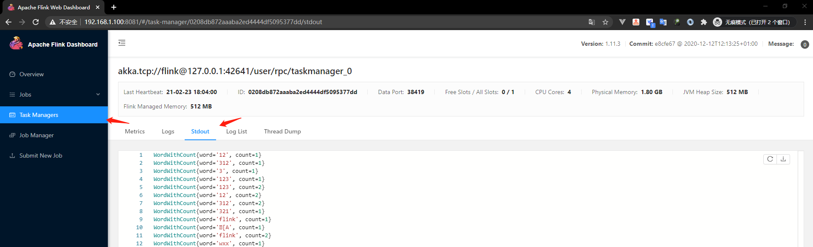

# Flink-入门

## 安装

为了能够运行Flink，唯一的要求是安装有效的**Java 8或11**。您可以通过发出以下命令来检查Java的正确安装：

```cmd
java -version
```

安装环境 centos7

下载Flink ，我这里安装的是[1.11.3版本](https://mirrors.bfsu.edu.cn/apache/flink/flink-1.11.3/flink-1.11.3-bin-scala_2.11.tgz)，下载好文件并压缩

```cmd
tar -zxvf flink-1.11.3-bin-scala_2.11.tgz
cd flink-1.11.3
```

### 启动

```cmd
 ./bin/start-cluster.sh
```

访问ip:8081，注意访问flink页面注意端口是否开放，防火墙是否关闭，否则访问不到

我们来写个代码，打包成jar，上传jar包启动，这里写的是Java语言

我们来使用flink的mvn命令来构建maven项目工程，注意使用mvn命令，需要要安装maven，这里我用的是window系统

在任何磁盘创建一个空的目录，打开cmd、对应创建的目录

```cmd
mvn archetype:generate -DarchetypeGroupId=org.apache.flink -DarchetypeArtifactId=flink-walkthrough-datastream-java -DarchetypeVersion=1.12.0 -DgroupId=frauddetection -DartifactId=frauddetection -Dversion=0.1 -Dpackage=spendreport -DgroupId=com.baerwang -DartifactId=flink_test -Dversion=1.0.0 -DinteractiveMode=false
```

生成好以后，打开项目，打开spendreport包名，里面有两个类(FraudDetectionJob、FraudDetector)把这些删掉，使用mvn生成项目使用他导入的包即可。

新建一个类(SocketTextStreamWordCount)

```java
package spendreport;

import org.apache.flink.api.common.functions.FlatMapFunction;
import org.apache.flink.api.java.functions.KeySelector;
import org.apache.flink.streaming.api.datastream.DataStream;
import org.apache.flink.streaming.api.datastream.DataStreamSource;
import org.apache.flink.streaming.api.environment.StreamExecutionEnvironment;

/**
 * @author baerwang
 * @since 2021/2/23 15:31
 */
public class SocketTextStreamWordCount {

    public static void main(String[] args) throws Exception {
        // 参数检查
        if (args.length != 2) {
            System.err.println("not null hostname port");
            return;
        }

        // 创建执行环境
        StreamExecutionEnvironment env = StreamExecutionEnvironment.getExecutionEnvironment();
        DataStreamSource<String> source = env.socketTextStream(args[0], Integer.parseInt(args[1]), "\n");
        // 转化处理数据
        // flatMap，也就是将嵌套集合转换并平铺成非嵌套集合
        // 对于map()来说，实现MapFunction也只是支持一对一的转换。
        // 那么有时候你需要处理一个输入元素，但是要输出一个或者多个输出元素的时候，就可以用到flatMap()。
        DataStream<WordWithCount> dataStream = source.flatMap((FlatMapFunction<String, WordWithCount>) (line, collector) -> {
            for (String word : line.split("\\w+")) {
                collector.collect(new WordWithCount(word, 1));
            }
        })
                // 以key分组统计
                .keyBy((KeySelector<WordWithCount, Object>) value -> value.word)
                /*     .timeWindow(Time.seconds(10))// 设置一个窗口函数，模拟数据流动*/
                // 计算时间窗口内的词语个数
                .sum("count");


        // 输出数据到目的端
        dataStream.print().setParallelism(1);

        // 执行任务操作
        env.execute("Fraud Detection");
    }

    public static class WordWithCount {
        public String word;
        public int count;

        public WordWithCount() {

        }

        public WordWithCount(String word, int count) {
            this.word = word;
            this.count = count;
        }

        @Override
        public String toString() {
            return "WordWithCount{" +
                    "word='" + word + '\'' +
                    ", count=" + count +
                    '}';
        }
    }
}

```

我们打开pom.xml文件修改下代码把启动指定的类换下刚才写的代码

```xml
<build>
		<plugins>
			<!-- 省略 -->
			<plugin>
				<groupId>org.apache.maven.plugins</groupId>
				<artifactId>maven-shade-plugin</artifactId>
				<version>3.0.0</version>
				<executions>
					<!-- Run shade goal on package phase -->
					<execution>
						<phase>package</phase>
						<goals>
							<goal>shade</goal>
						</goals>
						<configuration>
							<transformers>
								<transformer implementation="org.apache.maven.plugins.shade.resource.ManifestResourceTransformer">
									<mainClass>spendreport.SocketTextStreamWordCount</mainClass>
								</transformer>
							</transformers>
						</configuration>
					</execution>
				</executions>
			</plugin>
		</plugins>
		<!-- 省略 -->
</build>
```

打开cmd输入项目目录，使用mvn package 进行打包，会出现target目录里面有flink_test-1.0.0.jar包

然后在centos7 环境 输入命令然后输入任何文字

```cmd
nc -lk 9000
```


再去打开flink页面、点击Submit New Job导航(上传jar包提交新工作)、点击Add New(上传Jar包)、点击列表在Program Arguments输入框上输入 **127.0.0.1 9000** 提交


去点击Task Managers导航、里面有个列表，点击任意数据、再打开Stdout导航栏




 刚才在centos7系统下输入的文字，被显示出来了

使用命令行运行flink

先使用nc输入文字在使用flink命令行使用jar包

```cmd
./bin/flink run -c spendreport.SocketTextStreamWordCount /baerwang/flink_test-1.0.0.jar 127.0.0.1 9000
```

输入文字打开log/xxx.out日志

```cmd
tail -f log/xxx.out
```


### 暂停

```cmd
./bin/stop-cluster.sh
```

