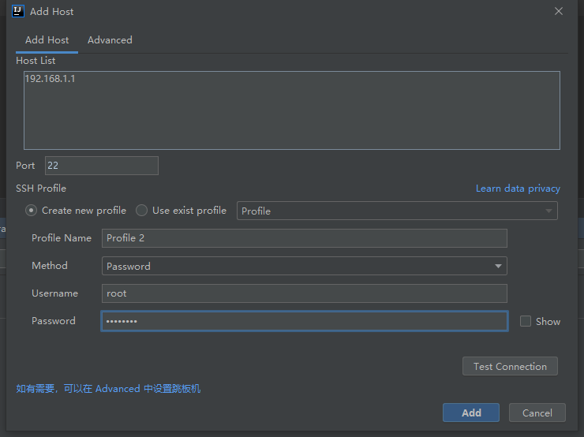
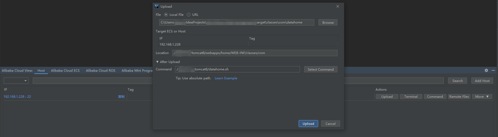
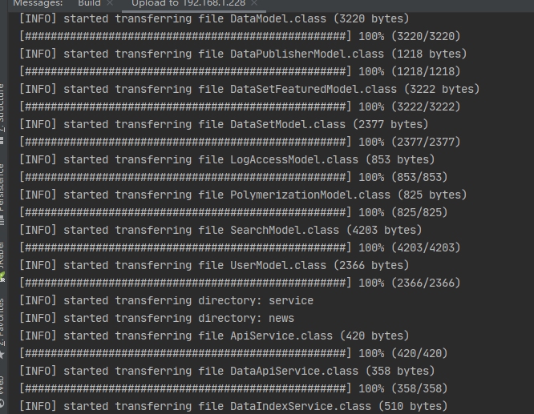

# 使用idea把项目部署到Tomcat

1. 在idea 插件上 下载Alibab Cloud toolkit

2. 在idea上导航栏tools 工具点击Alibaba Cloud

   1. Alibaba Cloud View
   2. Host

3. 添加服务器地址端口账号密码

   1. Add Host

   

4. 点击upload上传项目

   

   1. Local File：为本地项目的打包路径
   2. Location：服务器项目路径
   3. Command 服务器命令，这里我写的是启动tomcat 脚本，可以启动命令或脚本
   4. 编写脚本

   ```
   vim datahome.sh
   ```

   ```
   #!/bin/bash
   
   set -m
   
   cd /datahome/tomcat8/bin/
   
   ./shutdown.sh
   
   sleep 2
   
   ./startup.sh
   
   sleep 2
   
   tail -f /datahome/tomcat8/logs/catalina.out
   ```

   ```
   chmod 777 datahome.sh
   ```

   5. 点击upload 开始启动项目

      

      

